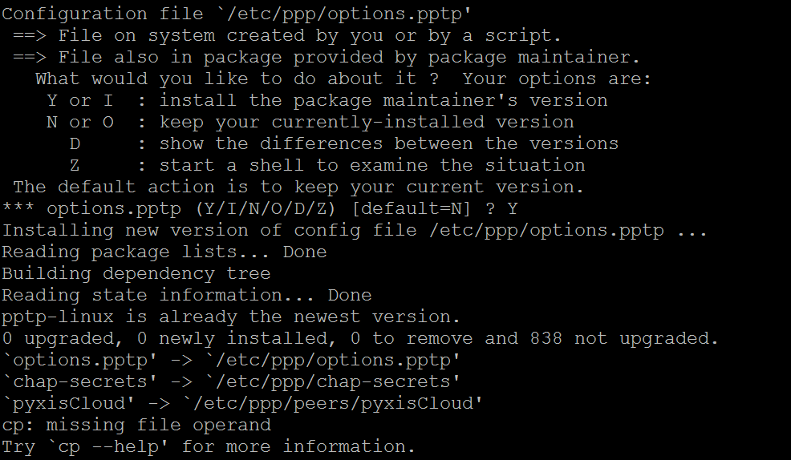

This is a Title
===============

That has a paragraph about a main subject and is set when the '='
is at least the same length of the title itself.

成语字典
----------------

 #. 闻过则喜，知错必改，过河卒子。
 #. 循序渐进，循循善诱，寻根究底
 #. 定气凝神，见微知著。
 #. 心领神会，融会贯通
 #. 

.. math::

    n_{\mathrm{offset}} = \sum_{k=0}^{N-1} s_k n_k

.. code-block:: python
   :emphasize-lines: 3,5

   def some_function():
       interesting = False
       print 'This line is highlighted.'
       print 'This one is not...'
       print '...but this one is.'
+------------------------+
|        !DANGER!        |
|                        |
| Beware killer rabbits! |
+------------------------+      
Inline Markup
-------------
Words can have *emphasis in italics* or be **bold** and you can define
code samples with back quotes, like when you talk about a command: ``sudo`` 
gives you super user powers!

1. 实现 a 列表的求和
2. 实现 2^10，2*2...相乘10次
3. 判断质数 prime
4. 判断某数有多少位
4. 1/2 + 1/4+1/8+1/16...求和
5. 模拟硬币正反面
6. 自学某个书本
7. 最大值，最小值
8. 统计字数
